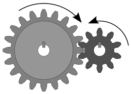
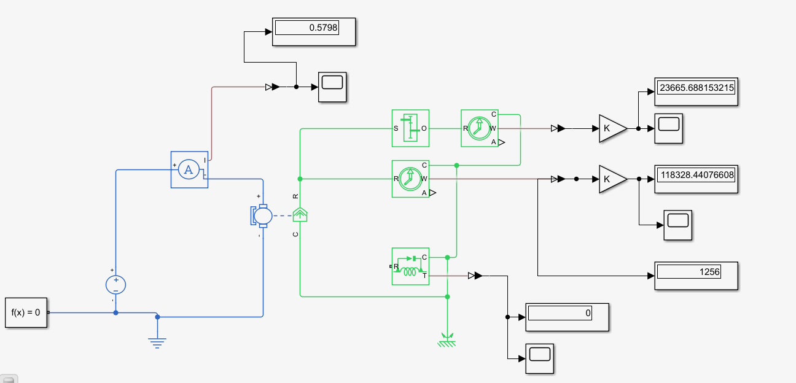
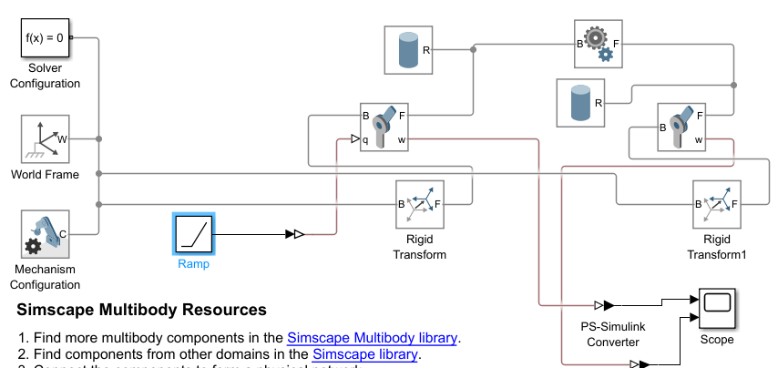
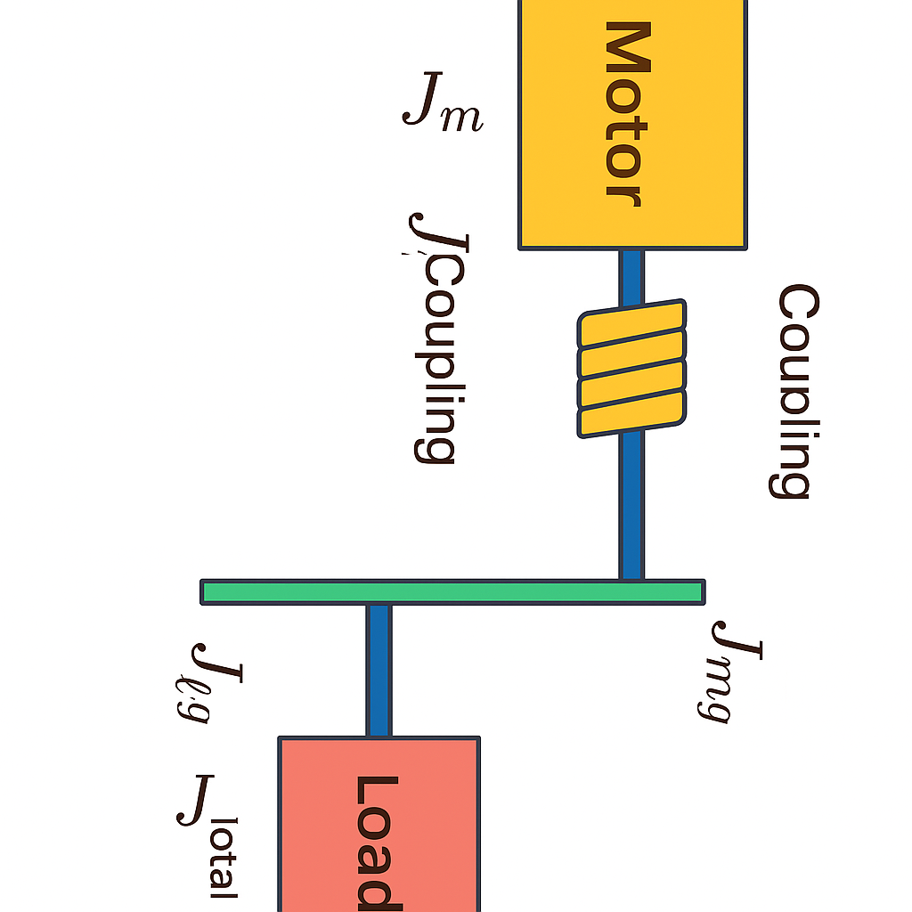

# CLASE_4_2
# Diseño de Sistemas de Transmisión en Control de Movimiento

## Objetivos del diseño ##  
  - Selección de motor y transmisión para cumplir perfiles de movimiento.  
  - Asegurar torque e inercia adecuados, para asegurar una buena relación de transmisión.

## Problemas de diseño ##
| Tipo | Información cocnocida                            | Encontrar / Dimensionar         |
|------|--------------------------------------------------|---------------------------------|
| 1    | Movimiento deseado de la carga                   | Transmisión y motor             |
| 2    | Motor y transmisión existentes                   | Movimiento resultante de la carga |
| 3    | Motor existente, movimiento deseado de la carga  | Transmisión                     |
| 4    | Movimiento deseado de la carga, transmisión      | Motor                           |

## Inercia y Torque Reflejado
- La inercia es la resistencia de un objeto al cambio en su velocidad angular:  
  $$\sum T = J \alpha$$
- Se utiliza en sistemas rotacionales y de traslación.
- Afectados por la relación de trasnmisión. 
  
## Tipos de Transmisiones Mecánicas
### Engranajes  

##
- **Relación de transmisión**:
  Se puede encontrar revisando la velocidad tangencial de las dos ruedas, o la potencia mecánica, y a partir de estas dos caracteristicas se pueden obtener las siguientes ecuaciones equivalentes. 
#### Ecuaciones de Transmisión

#### Definición de la Relación de Transmisión

La relación de transmisión está definida por:

$N_{GB}=\frac{\text{motor speed}}{\text{load speed}}$

---

- Velocidad tangencial:

$V_{\text{tangential}}=\omega_m r_m=\omega_l r_l$

- Relación de velocidades angulares:

$\frac{\omega_m}{\omega_l}=\frac{r_l}{r_m}$

- Relación de transmisión:

$N_{GB}=\frac{\omega_m}{\omega_l}=\frac{r_l}{r_m}$

---
- En función del número de dientes:

$\frac{n_l}{n_m}=\frac{r_l}{r_m}$

$N_{GB}=\frac{\omega_m}{\omega_l}=\frac{r_l}{r_m}=\frac{n_l}{n_m}$

---

#### Torque

- Potencia transmitida:

$\mathbb{P}=T_m \omega_m=T_l \omega_l$

- Relación de velocidades y torque:

$\frac{\omega_m}{\omega_l}=\frac{T_l}{T_m}$

---

#### Resultado

$N_{GB}=\frac{\omega_m}{\omega_l}=\frac{r_l}{r_m}=\frac{n_l}{n_m}=\frac{T_l}{T_m}$

**NOTA:** EL TORQUE QUE ESTA GENERANDO LA RUEDA MOTRIZ ES DIFERENTE AL TORQUE QUE EXPERIMENTA LA CARGA

### Simulaciones 

Simulink  

Simscape Multibody

 

### Inercia reflejada
---

Acople directo: Motor, eje y carga:  

$T_m = J_{load} \, \ddot{\theta}_m$

---

Sistema de engranajes: Motor, sistema de engranajes y carga:  

$T_l = J_{load} \, \ddot{\theta}_l$  

$\dfrac{r_l}{r_m} T_m = J_{load} \, \ddot{\theta}_l$  

Si se usa la relación de desplazamiento tangencial:   
$r_l \theta_l = r_m \theta_m$  

Obteniendo:  
$r_l \ddot{\theta}_l = r_m \ddot{\theta}_m$

$r_l \theta_l = r_m \theta_m$

Reemplazando:

$\dfrac{r_l}{r_m} T_m = J_{load} \, \dfrac{r_m}{r_l} \ddot{\theta}_m$  

Despejando:

$T_m = J_{load} \left( \dfrac{r_m}{r_l} \right)^2 \ddot{\theta}_m$

**Inercia reflejada**
$= J_{load} \, \dfrac{1}{N_{GB}^2} \ddot{\theta}_m$
---
### Torque reflejado 

De la relación dada por la potencia:    

$\frac{\omega_m}{\omega_l} = \frac{T_l}{T_m}$

$T_m = \frac{\omega_l}{\omega_m} T_l$

**Torque reflejado= $\quad = \frac{T_l}{N_{GB}}$**

### Eficiencia

Relación de salida y entrada  

$\quad P = T \cdot \omega$

$\eta = \frac{P_{output}}{P_{input}}$

$T_l \, \omega_l = \eta \, T_m \, \omega_m$

$T_m = \frac{T_l}{\eta \, N_{GB}}$

$J_{ref} = \frac{J_{load}}{\eta \, N_{GB}^2}$

Se debe tener en cuenta que los engranajes no son ideales, tienen una eficiencia puesto que se enfrentan a perdidas en cuanto a la fricción, el acople o demás, esta fricción la da en el fabricante, existen cajas desde 90 o hasta 95% de eficiencia. 

**PARA TODO EL DIMENSIONAMIENTO DEL MOTOR, SE CONOCE LA INERCIA TOTAL:**  

$J_{total} = J_m + J_{\text{on motor shaft}} + J_{ref}$    

$J_m$: Inercia ejer motor.  

$J_{\text{on motor shaft}}$: Inercia acople y transmisión.  

$J_{ref}$: Inercia reflejado.  

---
### Ejemplo

#### 1. 
   

$J_\text{total} = J_m + J_\text{on motor shaft} + J_\text{ref}$

$J_\text{on motor shaft} = J_\text{coupling} + J_\text{mg}$

$J_\text{ref} = \frac{1}{\eta N_\text{GB}^2} \left[ J_\text{lg} + J_\text{load} \right]$

$J_\text{total} = J_m + J_\text{coupling} + J_\text{mg} + \frac{1}{\eta N_\text{GB}^2} \left[ J_\text{lg} + J_\text{load} \right]$

#### 2.
El Sistema en la figura usa un engranaje PN023 de Apex Dynamics. Este tiene 5:1 de relación, 0,15 Kg − cm2 reflejado a la entrada y 97% de eficiencia. El motor es un Quantum QB02301 NEMA tamaño 23 de Allied Motion Technologies. Este tiene 1,5x10−5 Kg − m2 de inercia en el rotor. Si la inercia de la carga es 10x10−4 Kg − m2. Encuentre la relación de inercia

### Relación de inercia

Los relaciones de transmisión y de las caracteristicas de los mecanismos, estan dadas en terminos de relación d einercia, es decir el porcentaje de incercia total que tiene que mover el motor con respecto a la incercia del motor. 

#### Polea-Correa  
- **Relación de transmisión**:  
  \[ N_{\text{BP}} = \frac{r_{\text{polea conducida}}}{r_{\text{polea motora}}} \]  
- **Ejemplo**:  
  - Polea motora de 5 cm y conducida de 15 cm → \( N_{\text{BP}} = 3 \).  

#### Tornillo Guía (Lead Screw)  
- **Relación de transmisión**:  
  \[ N_S = 2\pi \cdot \text{Paso (m/rev)} \]  
- **Ejemplo**:  
  - Paso de 0.01 m/rev → \( N_S = 0.063 \).  

---

## Ejemplos (Diferentes al Documento)
### Ejemplo 1: Transmisión por Cadena  
- **Enunciado**:  
  Un motor con piñón de 10 dientes mueve una carga mediante una cadena y un piñón de 30 dientes. Calcule la inercia reflejada si \( J_{\text{load}} = 0.1 \, \text{kg·m}^2 \) y \( \eta = 95\% \).  
- **Solución**:  
  \[ J_{\text{ref}} = \frac{J_{\text{load}}}{\eta \cdot N_{\text{GB}}^2} = \frac{0.1}{0.95 \cdot 3^2} = 0.0117 \, \text{kg·m}^2 \]  

### Ejemplo 2: Transmisión por Correa Trapezoidal  
- **Enunciado**:  
  Una polea motora de 8 cm gira a 1200 RPM y mueve una polea conducida de 24 cm. Si la carga requiere 50 N·m, calcule el torque reflejado en el motor (\( \eta = 90\% \)).  
- **Solución**:  
  \[ T_{\text{ref}} = \frac{T_{\text{load}}}{\eta \cdot N_{\text{BP}}} = \frac{50}{0.9 \cdot 3} = 18.52 \, \text{N·m} \]  

---

## Ecuaciones Clave
1. **Inercia reflejada**:  
   \[ J_{\text{ref}} = \frac{J_{\text{load}}}{\eta \cdot N^2} \]  
2. **Torque reflejado**:  
   \[ T_{\text{ref}} = \frac{T_{\text{load}}}{\eta \cdot N} \]  
3. **Relación de velocidad**:  
   \[ N = \frac{\omega_{\text{motor}}}{\omega_{\text{load}}} \]  

---

## Figuras y Tablas
### Figura 1: Esquema de Transmisión por Engranajes  
  
*Descripción: Sistema motor-engranaje-carga con relación 3:1.*  

### Tabla 1: Comparación de Transmisiones  
| Tipo          | Ventajas                     | Desventajas               |  
|---------------|-----------------------------|---------------------------|  
| Engranajes    | Alta precisión               | Costo elevado             |  
| Polea-Correa  | Silenciosa                   | Deslizamiento posible     |  

---

## Ejercicios Prácticos
1. **Ejercicio 1**:  
   Un tornillo guía con paso de 0.02 m/rev mueve una carga de 80 kg. Calcule \( J_{\text{ref}} \) si \( \eta = 85\% \).  
   \[ \text{Solución: } J_{\text{ref}} = \frac{80}{(2\pi \cdot 0.02)^2 \cdot 0.85} \]  

2. **Ejercicio 2**:  
   Un motor con \( J_m = 0.01 \, \text{kg·m}^2 \) y relación de inercia \( J_R = 4 \). Determine la inercia total del sistema.  
   \[ \text{Solución: } J_{\text{total}} = J_m \cdot (1 + J_R) \]  

---

## Conclusiones
- El diseño de transmisiones requiere equilibrar torque, inercia y eficiencia.  
- La relación de transmisión es crítica para reflejar correctamente cargas al motor.  
- Simulaciones (e.g., Simscape) son herramientas esenciales para validar diseños.  

---

## Referencias
1. Universidad ECCI. *Control de Movimiento*. Disponible en: [www.ecci.edu.co](https://www.ecci.edu.co)  
2. Apex Dynamics. *Catálogo de Engranajes PN023*.  
3. Moog. *Especificaciones del Motor C23L33W10*.  
